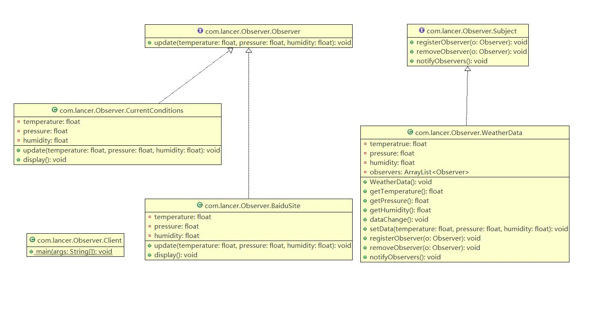

## 观察者模式原理

观察者模式类似订牛奶业务
- 1 奶站/气象局: Subject
- 2 用户/第三方网站: Observer

Subject: 登记注册,移除和通知
-  registerObserver 注册
-  removeObserver   移除
-  notifyObservers  通知所有的注册用户,根据不同需求,可以是更新数据,让用户来取,也可能是实施推送,看具体需求定。

Observer:接收输入
<div style="color:red">
观察者模式:对象之间多对一依赖的一种设计方案,被依赖对象为Subject,依赖对象Observer, Subject通知Observer变化,例如这里牛奶站是Subject,是1的一方,用户是Observer,是多的一方。
</div>

## 代码demo


Observer.java

```java
package com.lancer.Observer;

public interface Observer {
	public void update(float temperature, float pressure, float humidity);
}

```

Subject.java
```java
package com.lancer.Observer;

public interface Subject {
	public void registerObserver(Observer o);
	public void removeObserver(Observer o);
	public void notifyObservers();
}

```

WeatherData.java
```java
package com.lancer.Observer;

import java.util.ArrayList;

/**
 * 类是核心
 * 1. 包含最新的天气情况信息 
 * 2. 含有 观察者集合，使用ArrayList管理
 * 3. 当数据有更新时，就主动的调用   ArrayList, 通知所有的（接入方）就看到最新的信息
 * @author Administrator
 *
 */
public class WeatherData implements Subject {
	private float temperatrue;
	private float pressure;
	private float humidity;
	//观察者集合
	private ArrayList<Observer> observers;
	
	//加入新的第三方

	public WeatherData() {
		observers = new ArrayList<Observer>();
	}

	public float getTemperature() {
		return temperatrue;
	}

	public float getPressure() {
		return pressure;
	}

	public float getHumidity() {
		return humidity;
	}

	public void dataChange() {
		//调用 接入方的 update
		
		notifyObservers();
	}

	//当数据有更新时，就调用 setData
	public void setData(float temperature, float pressure, float humidity) {
		this.temperatrue = temperature;
		this.pressure = pressure;
		this.humidity = humidity;
		//调用dataChange， 将最新的信息 推送给 接入方 currentConditions
		dataChange();
	}

	//注册一个观察者
	@Override
	public void registerObserver(Observer o) {
		// TODO Auto-generated method stub
		observers.add(o);
	}

	//移除一个观察者
	@Override
	public void removeObserver(Observer o) {
		// TODO Auto-generated method stub
		if(observers.contains(o)) {
			observers.remove(o);
		}
	}

	//遍历所有的观察者，并通知
	@Override
	public void notifyObservers() {
		// TODO Auto-generated method stub
		for(int i = 0; i < observers.size(); i++) {
			observers.get(i).update(this.temperatrue, this.pressure, this.humidity);
		}
	}
}

```

CurrentConditions.java
```java
package com.lancer.Observer;

public class CurrentConditions implements Observer {

	// 温度，气压，湿度
	private float temperature;
	private float pressure;
	private float humidity;

	// 更新 天气情况，是由 WeatherData 来调用，我使用推送模式
	public void update(float temperature, float pressure, float humidity) {
		this.temperature = temperature;
		this.pressure = pressure;
		this.humidity = humidity;
		display();
	}

	// 显示
	public void display() {
		System.out.println("***Today mTemperature: " + temperature + "***");
		System.out.println("***Today mPressure: " + pressure + "***");
		System.out.println("***Today mHumidity: " + humidity + "***");
	}
}

```
BaiduSite.java
```java
package com.lancer.Observer;

public class BaiduSite implements Observer {

	// 温度，气压，湿度
	private float temperature;
	private float pressure;
	private float humidity;

	// 更新 天气情况，是由 WeatherData 来调用，我使用推送模式
	public void update(float temperature, float pressure, float humidity) {
		this.temperature = temperature;
		this.pressure = pressure;
		this.humidity = humidity;
		display();
	}

	// 显示
	public void display() {
		System.out.println("===百度网站====");
		System.out.println("***百度网站 气温 : " + temperature + "***");
		System.out.println("***百度网站 气压: " + pressure + "***");
		System.out.println("***百度网站 湿度: " + humidity + "***");
	}

}
```
Client.java
```java
package com.lancer.Observer;

public class Client {

	public static void main(String[] args) {
		// TODO Auto-generated method stub
		//创建一个WeatherData
		WeatherData weatherData = new WeatherData();
		
		//创建观察者
		CurrentConditions currentConditions = new CurrentConditions();
		BaiduSite baiduSite = new BaiduSite();
		
		//注册到weatherData
		weatherData.registerObserver(currentConditions);
		weatherData.registerObserver(baiduSite);
		
		//测试
		System.out.println("通知各个注册的观察者, 看看信息");
		weatherData.setData(10f, 100f, 30.3f);
		
		
		weatherData.removeObserver(currentConditions);
		//测试
		System.out.println();
		System.out.println("通知各个注册的观察者, 看看信息");
		weatherData.setData(10f, 100f, 30.3f);
	}

}
```